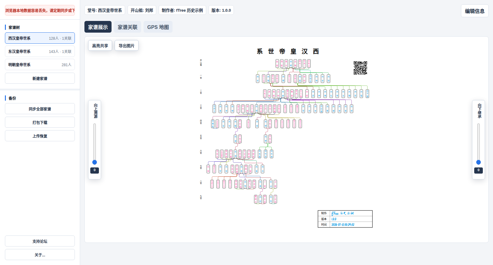
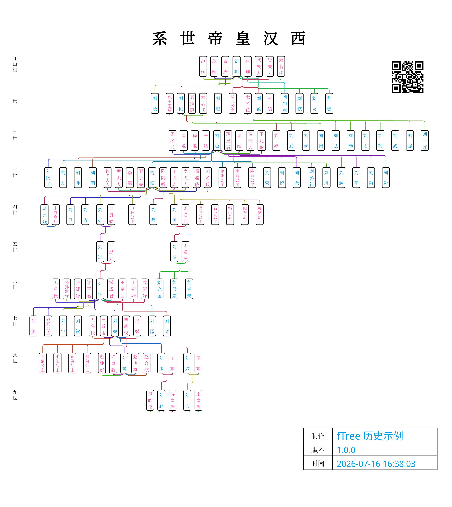

# fTree 使用与维护文档

fTree 是一套面向个人和家族资料维护场景的家谱服务。私人空间版无需注册，家谱默认保存在当前浏览器；用户可以下载加密的 `.tree` 备份，也可以授权 Google Drive、GitHub 或 GitLab 保存云端副本。

## 项目网站

- 私人空间版：<https://home.ftree.club>
- 项目 Wiki：<https://github.com/mulspace/ftree/wiki>
- 数据操守与操作手册：[docs/HANDBOOK.md](docs/HANDBOOK.md)

团队协作版面向工作组及多人长期维护场景，当前未开放公开注册。开放和试用信息以项目网站及 Wiki 公告为准。

## 文档导航

- [完整用户操作指南](docs/USER_GUIDE.md)
- [西汉历史家谱示例与资料说明](docs/HISTORICAL_SAMPLE.md)
- [隐私与数据保护说明](docs/PRIVACY.md)
- [数据操守与操作手册](docs/HANDBOOK.md)

## 主要能力

- 在一个工作区内创建和维护多个家谱。
- 维护姓名、性别、在世状态、备注、GPS 位置及亲属关系。
- 编辑父母、配偶、子女关系及子女顺序。
- 指定开山祖，并从任意成员重新查看家谱分支。
- 关联不同家谱中的同名、同性别成员。
- 在地图中查看已设置 GPS 的成员。
- 导出家谱图片。
- 下载、导入加密的 `.tree` 备份。
- 将全部家谱同步至 Google Drive、GitHub 或 GitLab。

## 图文预览

首次打开会加载西汉、东汉和明朝三套公开历史示例。它们用于演示多家谱管理、成员关系、GPS 地图和跨家谱关联，不包含真实用户资料。

西汉示例完整图包含 128 个人物节点、10 个世代层级、称号、人物备注及 9 个陵寝或遗址代表坐标。字段含义、坐标来源和历史不确定性见[西汉历史家谱示例说明](docs/HISTORICAL_SAMPLE.md)。

## 数据保存概览

| 位置 | 保存内容 | 说明 |
| --- | --- | --- |
| 当前浏览器 | 完整加密家谱档案 | 这是私人空间版的默认数据源；清理站点数据可能导致丢失。 |
| Google Drive | 隐藏应用数据目录中的 `default.tree` | 不出现在普通云盘目录中，只供已授权应用访问。 |
| GitHub | Secret Gist 中的 `default.tree` | Secret Gist 不会公开检索，但并非严格私有；知道链接的人仍可能访问。 |
| GitLab | Private Snippet 中的 `default.tree` | 由用户自己的 GitLab 账户控制。 |
| 服务端 | OAuth 应用配置和静态网站资源 | 应用不建立用户账户库，也不持久化家谱正文或用户 OAuth Token。 |

云同步时，加密档案会经过 fTree 后端转发。fTree 后端在单次请求中临时处理 OAuth 凭据和加密档案，但应用代码不把这些内容写入数据库、KV、对象存储或服务器文件。

## 五分钟开始使用

1. 使用现代浏览器打开 <https://home.ftree.club>。
2. 首次进入会看到示例家谱；可以保留、修改或删除示例。
3. 点击“新建家谱”，填写堂号、开山祖、制作者和版本。
4. 点击成员节点，在成员信息中修改资料或进入亲属关系编辑。
5. 完成一轮录入后，立即点击“打包下载”保存 `.tree` 文件。
6. 如需跨设备使用，打开“同步全部家谱”，选择个人云服务并完成授权。
7. 在第二台设备上先下载一份本地备份，再执行“下载云端当前版本”。

## 使用前必须了解

1. 浏览器本地数据不是可靠的长期备份。无痕模式、清理缓存、重装浏览器、系统故障或设备丢失都可能使数据不可恢复。
2. `.tree` 文件虽然经过压缩和加密，但使用程序内置口令，没有用户独享密码，只能作为一般隐私屏障。
3. GitHub 的 Secret Gist 不是严格私有存储。敏感家谱优先使用 Google Drive 应用数据目录或 GitLab Private Snippet，并妥善保护账户。
4. 云端授权退出只会清除当前浏览器的授权 Cookie，不会删除已经保存在第三方云服务中的档案。
5. 家谱可能包含在世人员姓名、关系、备注和精确位置。录入、共享或导出前应取得必要同意，并遵循最少收集原则。
6. 云端上传和下载是全工作区覆盖操作。确认方向前，应比较修改时间、家谱数和成员数，并先下载本地备份。

## 建议的备份习惯

- 每次集中录入后下载一份 `.tree`。
- 每月至少验证一次备份能否正常读取。
- 同时保留浏览器本地、个人云端和离线介质三份副本。
- 不要通过公共群聊、论坛、公开网盘链接传播家谱备份。
- 文件名建议包含日期，例如 `ftree-family-2026-07-16.tree`。

## 支持与反馈

项目联系人：Kevin Fu（[fujintang@gmail.com](mailto:fujintang@gmail.com)）。

所有反馈统一通过 GitHub 分类提交并公开追踪：

- 新功能和体验改进：使用[需求 Issue 表单](https://github.com/mulspace/ftree/issues/new?template=feature_request.yml)，并在[需求列表](https://github.com/mulspace/ftree/wiki/需求列表)追踪。
- 页面错误、数据异常和同步故障：使用[问题 Issue 表单](https://github.com/mulspace/ftree/issues/new?template=bug_report.yml)，并在[问题列表](https://github.com/mulspace/ftree/wiki/问题列表)追踪。
- 使用咨询、文档讨论和其他非故障事项：在 Wiki [其他列表](https://github.com/mulspace/ftree/wiki/其他列表)登记。

提交前请阅读[支持与反馈填写规范](SUPPORT.md)。不得附带真实 `.tree`、OAuth Token、Cookie、Client Secret、在世人员详细资料或精确 GPS。

## 仓库范围

本仓库用于发布 fTree 的公开说明、用户指南、隐私说明和维护手册。文档不构成对第三方云服务可用性、永久保存或数据恢复能力的保证。
